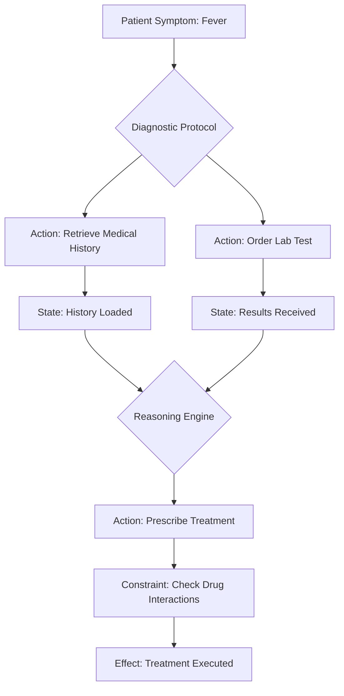

An action-oriented ontology for agentic systems is a structured framework that defines **entities**, **actions**, **relationships**, and **constraints** to enable autonomous decision-making and task execution. Unlike traditional ontologies focused on static knowledge, it emphasizes **dynamic processes**, **goal-driven behaviors**, and **real-world interactions**. Below is a detailed breakdown of its components, structure, and implementation:

---

### 🔧 1. **Core Components of an Action-Oriented Ontology**
#### **a) Entities & Relationships**  
- **Entities**: Represent actors, objects, or concepts (e.g., `User`, `Task`, `Tool`, `Data Source`).  
- **Relationships**: Define interactions between entities (e.g., `User initiates Task`, `Tool executes Action`).  
- **Example**: In healthcare, entities like `Patient`, `DiagnosticTool`, and `Treatment` are linked via relationships such as `undergoes test` or `receives prescription`.  

#### **b) Actions & Capabilities**  
- **Actions**: Atomic operations agents perform (e.g., `retrieve_data`, `calculate_risk`, `send_alert`). Each action includes:  
  - **Preconditions**: Requirements to trigger the action (e.g., `User authentication completed`).  
  - **Effects**: Outcomes post-execution (e.g., `Database updated`, `Notification sent`).  
- **Capabilities**: Higher-level skills combining actions (e.g., `FraudDetection = analyze_transactions + flag_anomalies`).  

#### **c) State & Transitions**  
- **State Variables**: Track real-time conditions (e.g., `System_Status: active/error`, `Task_Progress: 70%`).  
- **State Transitions**: Rules governing how actions change states (e.g., `IF anomaly_detected THEN trigger_alert`).  

#### **d) Constraints & Guardrails**  
- **Ethical Boundaries**: Rules preventing harmful actions (e.g., "Do not share sensitive data without consent").  
- **Operational Limits**: Thresholds for autonomous decisions (e.g., "Escalate to human if financial risk > $10K").  

---

### 🏗️ 2. **Structural Principles**
#### **a) Goal-Driven Hierarchy**  
- Goals decompose into sub-tasks (e.g., `Optimize_SupplyChain → Forecast_Demand → Adjust_Inventory`).  
- Each sub-task maps to executable actions, enabling step-by-step goal achievement.  

#### **b) Process Formalization**  
- Workflows codify sequences (e.g., `Customer_Complaint → Verify_Issue → Resolve_or_Escalate`).  
- **Decision Points**: Branches based on conditions (e.g., `IF issue_complex THEN assign_specialist`).  

#### **c) Interoperability Standards**  
- **APIs & Protocols**: Standardized interfaces (e.g., REST, gRPC) for tool integration.  
- **Semantic Mappings**: Unified definitions for cross-system communication (e.g., `"Patient_ID" ≡ "P123" in EHR system`).  

#### **d) Dynamic Knowledge Integration**  
- **Real-Time Data Feeds**: Sensors, databases, or user inputs update ontology states.  
- **Learning Mechanisms**: Feedback loops refine action outcomes (e.g., reinforcement learning for route optimization).  

---

### ⚙️ 3. **Operational Semantics for Execution**
#### **a) Tool & Function Embedding**  
- Tools (e.g., `SQL_Query_Tool`, `API_Connector`) are defined with:  
  - **Input/Output Schemas**: Parameters and expected results.  
  - **Invocation Protocols**: How agents access them (e.g., via `function_call`).  

#### **b) Contextual Reasoning Rules**  
- **Causal Links**: Ensure actions align with goals (e.g., `IF sales_decline THEN activate_promotion`).  
- **Resource Management**: Rules for allocating computational/memory resources during action execution.  

---

### 🧩 4. **Implementation Considerations**
#### **a) Modular Design**  
- Reusable components (e.g., prebuilt `Authentication_Module` or `Data_Validator`) accelerate development.  

#### **b) Governance & Evolution**  
- **Version Control**: Track ontology changes (e.g., new constraints added).  
- **Collaboration Frameworks**: Domain experts + AI engineers co-define entities/actions.  

#### **c) Integration with AI Architectures**  
- **Knowledge Graphs**: Encode relationships for semantic reasoning (e.g., `Drug → treats → Disease` in healthcare).  
- **Multi-Agent Coordination**: Shared ontology allows agents to delegate tasks (e.g., `Planner_Agent → Validator_Agent`).  

---

### 🏥 5. **Real-World Example: Healthcare Diagnosis Agent**

- **Entities**: `Patient`, `Lab_System`, `Treatment_Guidelines`.  
- **Actions**: `Order_Test`, `Analyze_Results`, `Prescribe_Drug`.  
- **Constraints**: "Verify allergies before prescribing".  

---

### ⚠️ 6. **Challenges & Solutions**
- **Ambiguity in Actions**: Use ontologies to disambiguate terms (e.g., `"block" in cybersecurity ≠ "block" in supply chain`).  
- **Scalability**: Fragment ontology into domain-specific sub-ontologies (e.g., `Finance_Ontology`, `Manufacturing_Ontology`).  
- **Traceability**: Log decision paths for auditing (e.g., `Why did agent deny loan?`).  

---

### 💎 **Conclusion**  
An action-oriented ontology transforms agentic systems from reactive tools to proactive collaborators by:  
1. **Encoding actionable knowledge** with precise preconditions/effects.  
2. **Orchestrating multi-agent workflows** through shared semantic standards.  
3. **Embedding guardrails** for ethical, efficient autonomy.  
For maximal impact, integrate it with **LLM reasoning engines** (e.g., via RAG) and **real-time data pipelines**, ensuring agents operate within a coherent, adaptive operational universe.
