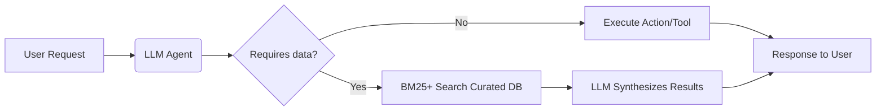

LLMs provide agent systems with capabilities fundamentally **beyond** what traditional search (BM25 + curated datasets) can achieve, enabling true agency rather than mere information retrieval. Here’s why:

---

### 🧠 **Core Advantages of LLMs in Agent Systems**  
| **Capability**          | **LLM-Based Agents**                     | **BM25 + Curated Data**               |  
|-------------------------|------------------------------------------|---------------------------------------|  
| **Reasoning**           | Multi-step logic, abstraction, inference | Keyword matching (no true reasoning)  |  
| **Context Handling**    | Understands nuance, ambiguity, context  | Literal term matching only            |  
| **Adaptability**        | Learns from interactions (fine-tuning)  | Static datasets (manual updates)      |  
| **Task Execution**      | **Generates code/tools/actions**        | Returns documents (passive retrieval) |  
| **Ambiguity Resolution**| Asks clarifying questions               | Returns top matches (even if irrelevant)|  

---

### 🔍 **Why Traditional Search Falls Short for Agents**  
1. **No Real-World Action**  
   - BM25 retrieves documents; LLMs **generate executable plans**:  
     ```python  
     # LLM Agent output:  
     plan = [  
         "Step 1: Query warehouse API for inventory",  
         "Step 2: Calculate shipping costs via FedEx tool",  
         "Step 3: Email client with delivery estimate"  
     ]  
     ```  
   - *BM25 Alternative:* Returns inventory PDF + FedEx pricing doc – *you* assemble the workflow.

2. **Zero Dynamic Adaptation**  
   - LLMs adjust to novel scenarios (e.g., "Handle supply chain disruption during strikes").  
   - Curated datasets fail when:  
     - Queries don’t match pre-indexed terms  
     - Solutions require combining 5+ data sources  

3. **Brittle to Human Language**  
   | **User Query**               | **BM25 Result**                     | **LLM Agent Action**               |  
   |------------------------------|-------------------------------------|------------------------------------|  
   | *"Help me not go broke"*     | Articles about bankruptcy           | Generates personalized budget plan |  
   | *"Make the pain stop"*       | Medical documents about analgesics  | Schedules doctor appointment       |  

---

### ⚙️ **Technical Edge Cases Enabled by LLMs**  
1. **Tool Creation on Demand**  
   - LLMs can *generate* new tools:  
     > *"User needs CSV analysis → Python script created → Executed → Results returned"*  
   - BM25: Returns existing CSV tools (if keyword matches).

2. **Cross-Domain Synthesis**  
   - **Query:** *"Assess climate risk for our Tokyo office"*  
     - LLM agent: Combines real-time weather APIs + financial data + regulatory docs.  
     - BM25: Returns disconnected climate/finance/legal documents.

3. **Negotiation & Persuasion**  
   - LLMs simulate human-like dialogue (e.g., rescheduling meetings via email).  
   - Search engines: Can’t draft context-aware responses.

---

### 📉 **Where BM25 + Curated Data Still Wins**  
| **Use Case**               | **Why It’s Better**                          |  
|----------------------------|----------------------------------------------|  
| Regulatory compliance docs | Deterministic results (no hallucination)     |  
| Medical code lookups       | Precision > creativity                       |  
| Version-controlled manuals | Exact matches critical                       |  

---

### 🔮 **The Hybrid Future**  
Smart agent systems **combine both**:  

- Example: Healthcare agent uses:  
  1. **BM25**: Retrieve drug interaction database  
  2. **LLM**: Generate patient-friendly explanation + dosage plan  

---

### 💎 **Conclusion**  
LLMs transform agents from **document librarians** into **active problem-solvers** by adding:  
1. **Reasoning engines** (not just retrieval),  
2. **Adaptive tool use**,  
3. **Real-world action orchestration**.  

While BM25 + curated data remains superior for *deterministic lookup*, LLMs enable agents to handle the **fuzzy, dynamic, and open-ended problems** that define real human needs. The future belongs to systems that fuse both.
