Here's a clear comparison between agentic systems and search/federated search platforms (like Glean or Elastic), highlighting their fundamental differences in purpose, architecture, and capabilities:

---

### 🧠 **Core Differences**
| **Aspect**               | **Agentic Systems**                            | **Search/Federated Search (Glean, Elastic)**       |
|--------------------------|-----------------------------------------------|---------------------------------------------------|
| **Primary Purpose**      | **Perform tasks** autonomously                | **Retrieve information** from datasets            |
| **Output**               | Actions, decisions, generated content         | Relevant documents/snippets (passive results)     |
| **Intelligence Level**   | Reason, plan, and act (LLM-powered)           | Match queries to indexed content (algorithmic)    |
| **Autonomy**             | High (can execute multi-step workflows)       | Zero (requires human interpretation/action)       |
| **Data Interaction**     | Creates new data/takes actions                | Queries existing data                             |
| **User Role**            | Collaborator with AI                          | Information consumer                              |

---

### ⚙️ **Functional Comparison**
#### **1. Information vs. Action**
- **Search Engines (Glean/Elastic)**:
  - *Input*: "Show Q3 sales reports for EMEA region"
  - *Output*: List of documents containing "Q3," "sales," "EMEA"
  - *User must*: Open files, extract insights manually

- **Agentic System**:
  - *Input*: "Analyze Q3 EMEA sales trends and email summary to CFO"
  - *Output*: 
    - Extracts data from reports
    - Generates visualizations + insights
    - Sends email to CFO
  - *User does*: Nothing (task fully automated)

#### **2. Handling Ambiguity**

```mermaid
flowchart LR
    A[User Query: “Fix our server issue”] 
    A --> B[Search Engine]
    A --> C[Agentic System]
    B --> D["Returns: Server manuals, error logs (mixed relevance)"]
    C --> E["Actions: Diagnose logs → Patch software → Reboot servers → Confirm resolution"]
```

#### **3. Cross-System Integration**
- **Federated Search (Glean)**:
  - *Strength*: Unified results from Slack, Drive, DBs  
  - *Limitation*: Can't **act** on results (e.g., can't auto-create Jira ticket from bug report)

- **Agentic System**:
  - *Strength*: Seamless tool orchestration  
  > Example: Detects bug in log → Creates Jira ticket → Assigns engineer → Posts Slack alert

---

### 🔍 **Technical Architecture**
#### **Search Engines (Elastic/Glean Core)**:

#### **Agentic Systems**:

---

### 💼 **Enterprise Use Cases**
| **Scenario**              | **Search Engine Solution**            | **Agentic Solution**                     |
|---------------------------|---------------------------------------|------------------------------------------|
| Employee onboarding       | New hire finds 12 disparate HR docs   | Agent auto-schedules training, grants system access |
| Customer complaint        | Returns past tickets/knowledge base   | Analyzes sentiment, processes refund, updates CRM |
| Competitive analysis      | Aggregates competitor web content     | Generates SWOT report + strategic recommendations |

---

### 🔄 **Synergy Potential**
**Hybrid Architecture** (where both coexist):

```mermaid
flowchart LR
    User --> Agent
    Agent --> Search{“Need data?”}
    Search -->|Yes| Glean/Elastic
    Search -->|No| Tools[APIs/Code]
    Glean/Elastic --> Agent
    Tools --> Agent
    Agent --> Result[Task Output]
```

> Example:  
> 1. Agent receives: "Resolve customer's shipping delay"  
> 2. Uses Glean → Finds order DB schema + policy docs  
> 3. Executes: Pulls order data → Issues refund → Updates Zendesk  

---

### ✅ **Key Takeaways**
1. **Search/Federated Search**:
   - Best for **information discovery**  
   - Limited to **what exists** in indexed content  
   - Requires human effort to **act** on results

2. **Agentic Systems**:
   - Focus on **goal achievement**  
   - Synthesize information + **take actions**  
   - Handle **open-ended problems** autonomously

**Future integration**: Next-gen platforms (e.g., Glean + Copilot) will embed agents *within* search interfaces to enable "retrieve → act" workflows.
