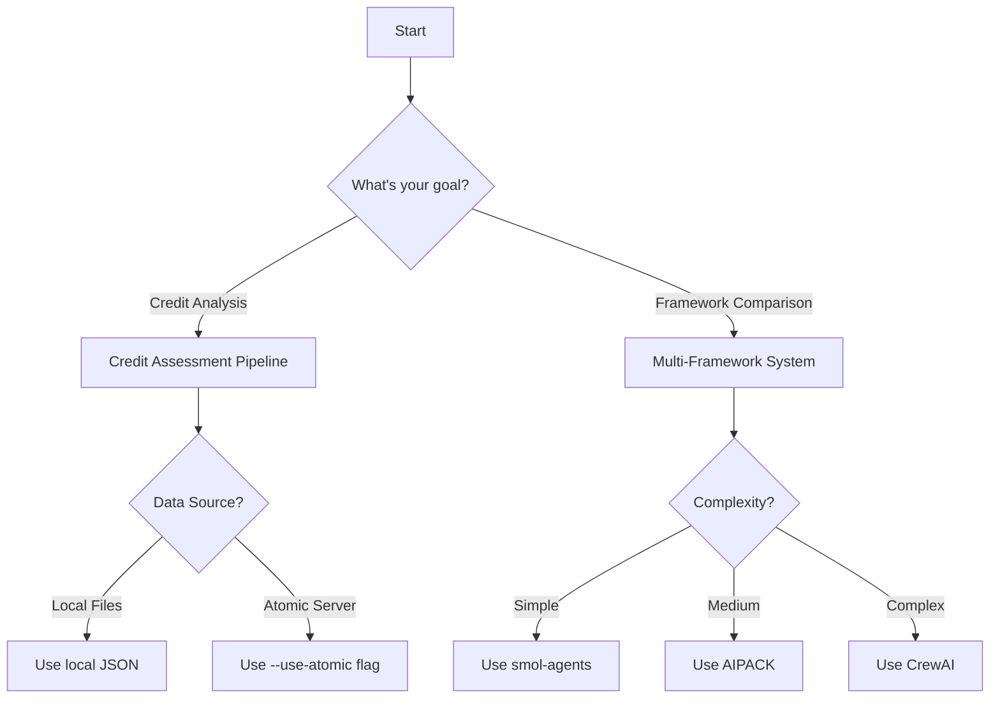

# Pipeline Documentation

## Available Pipelines

### 1. [Credit Assessment Pipeline](./credit-assessment.md)
Automated credit risk assessment system using LLMs with support for multiple data formats and real-time data fetching from Atomic Server.

**Key Features:**
- Multi-format support (JSON, JSON-AD, Turtle/RDF)
- Atomic Server integration
- Comprehensive financial analysis
- Batch processing capabilities

### 2. [Multi-Framework Evaluation System](./multi-framework.md)
Comparative benchmarking platform for evaluating different AI frameworks across various LLM models.

**Supported Frameworks:**
- AIPACK - Traditional evaluation with mature patterns
- CrewAI - Multi-agent orchestration for complex workflows
- smol-agents - Lightweight framework for simple evaluations

## Quick Comparison

| Pipeline | Purpose | Input Types | Output Format | Complexity |
|----------|---------|-------------|---------------|------------|
| Credit Assessment | Financial risk evaluation | JSON, JSON-AD, Turtle | Markdown reports | Medium |
| Multi-Framework | Framework benchmarking | Task definitions | Comparative metrics | High |

## Common Use Cases

### Credit Risk Analysis
Use the Credit Assessment Pipeline when you need to:
- Evaluate company creditworthiness
- Generate detailed risk reports
- Process multiple data formats
- Integrate with semantic web technologies

### Framework Evaluation
Use the Multi-Framework System when you need to:
- Compare different AI frameworks
- Benchmark model performance
- Evaluate task-specific capabilities
- Optimize framework selection

## Pipeline Selection Guide



## Running Pipelines

All pipelines follow a consistent execution pattern:

```bash
# General pattern
uv run python [pipeline_directory]/[script].py [options]

# Credit Assessment example
uv run python credit_assessment_pipeline/run_credit_assessment.py \
  --models llama3.2:3b \
  --format json-ad \
  --use-atomic

# Multi-Framework example
uv run python evaluation_pipelines/run_evaluation.py \
  --framework aipack \
  --model llama3.2:3b \
  --task code_analysis
```

## Pipeline Architecture

### Shared Components
- **Data Loaders**: Handle multiple data formats
- **Model Interface**: Ollama integration
- **Report Generators**: Structured output creation
- **Error Handlers**: Robust error recovery

### Pipeline-Specific Components
- **Credit Assessment**: Prompt templates, financial metrics calculators
- **Multi-Framework**: Framework adapters, metric aggregators

## Performance Characteristics

| Pipeline | Typical Duration | Memory Usage | CPU Usage |
|----------|-----------------|--------------|-----------|
| Credit Assessment (single) | 30-60s | 2-4GB | 40-60% |
| Credit Assessment (batch) | 5-30min | 4-8GB | 60-80% |
| Multi-Framework (AIPACK) | 45-90s | 3-5GB | 50-70% |
| Multi-Framework (CrewAI) | 60-120s | 4-6GB | 60-80% |
| Multi-Framework (smol) | 30-60s | 2-3GB | 30-50% |

## Extending Pipelines

### Adding New Data Sources
1. Implement data loader function
2. Add format handler
3. Update command-line arguments
4. Document in pipeline guide

### Creating Custom Pipelines
1. Inherit from base classes
2. Implement required methods
3. Add configuration support
4. Create documentation

## Best Practices

1. **Start Small**: Test with one model before batch processing
2. **Monitor Resources**: Check memory and CPU usage
3. **Use Appropriate Formats**: Choose format based on use case
4. **Enable Logging**: Set log level for debugging
5. **Save Intermediate Results**: Use checkpointing for long runs

## Troubleshooting

### Common Issues
- Model not found → Pull with `ollama pull`
- Network timeout → Increase timeout settings
- Memory errors → Use smaller models or reduce batch size
- Format errors → Verify data structure matches format

### Getting Help
- Check pipeline-specific documentation
- Review [API Reference](../api/README.md)
- See [Troubleshooting Guide](../configuration/troubleshooting.md)

## Future Pipelines

Planned additions:
- Code Quality Assessment Pipeline
- Documentation Generation Pipeline
- Test Case Generation Pipeline
- Security Analysis Pipeline