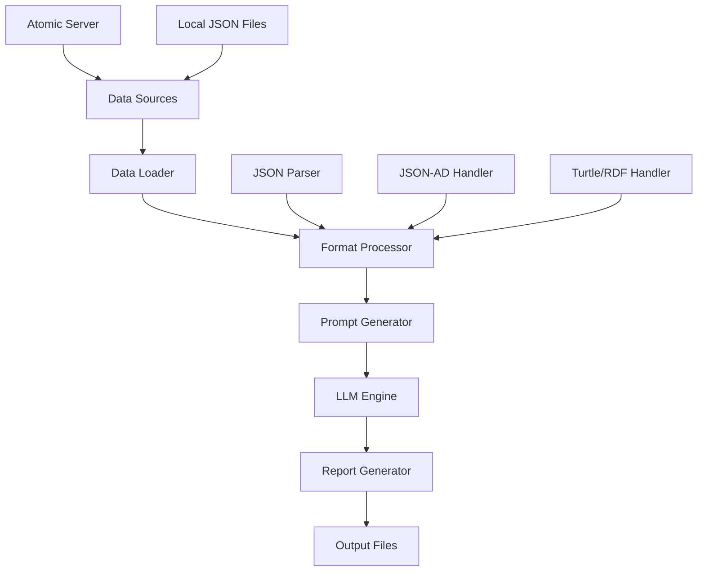

# Credit Assessment Pipeline

## Overview

The Credit Assessment Pipeline is an automated system for generating comprehensive credit risk assessments using Large Language Models. It combines structured financial data with Dynamic Risk Scoring (DRS) metrics to produce detailed credit evaluation reports.

## Features

- **Multi-Model Support**: Compatible with 19+ Ollama models with optimized timeouts
- **Real-Time Data Fetching**: Integration with Atomic Server for live semantic data
- **Multiple Data Formats**: JSON, JSON-AD, and Turtle/RDF support with format-aware processing
- **Automated Report Generation**: Structured markdown reports with comprehensive financial analysis
- **Batch Processing**: Parallel evaluation with dynamic model discovery and error isolation
- **Fallback Mechanisms**: Robust local file support when server unavailable
- **Performance Optimization**: Model-specific timeout configuration based on parameter count
- **Error Recovery**: Exponential backoff retry logic with graceful degradation

## Architecture



## Data Sources

### 1. Company Information
Contains company profile and financial metrics:
- Basic information (name, industry, location)
- Financial metrics (revenue, employees, growth)
- Credit ratings and payment history
- Financial ratios (debt-to-equity, current ratio, margins)

### 2. Dynamic Risk Score (DRS)
Comprehensive risk assessment data:
- Qualitative and quantitative scores
- Key performance indicators
- Risk factors and mitigation strategies
- Management quality assessments

### 3. Reference Data
Industry benchmarks and scoring criteria:
- Sector-specific thresholds
- Comparative metrics
- Risk classification guidelines

## Data Formats

### JSON Format
Standard JSON with field substitution into prompt templates:
```json
{
  "name": "Detra Energy",
  "industry": "Renewable Energy",
  "creditRating": "A-",
  "financialHealth": "Good"
}
```

### JSON-AD Format
Atomic Data format with semantic properties:
```json
{
  "@id": "https://charm.terraphim.io/account/735329000000458254",
  "https://charm.terraphim.io/properties/name": "Detra Energy",
  "https://charm.terraphim.io/properties/industry": "Renewable Energy"
}
```

### Turtle/RDF Format
Resource Description Framework for linked data:
```turtle
<https://charm.terraphim.io/account/735329000000458254>
    a :Account ;
    :name "Detra Energy" ;
    :industry "Renewable Energy" .
```

## Usage

### Basic Usage

```bash
# Always activate virtual environment first
source .venv/bin/activate

# Run with default settings (local files, JSON format)
cd credit-assessment-system/credit_assessment_pipeline
python run_credit_assessment.py --models llama3.2:3b
```

### Semantic Data Integration

```bash
# Fetch standard JSON data from Atomic Server
python run_credit_assessment.py \
  --models llama3.2:3b \
  --format json \
  --use-atomic

# Use JSON-AD format (preserves semantic relationships)
python run_credit_assessment.py \
  --models llama3.2:3b \
  --format json-ad \
  --use-atomic

# Use Turtle/RDF format (full linked data support)
python run_credit_assessment.py \
  --models llama3.2:3b \
  --format turtle \
  --use-atomic
```

### Model-Optimized Execution

```bash
# Fast models for quick feedback (< 90s)
python run_credit_assessment.py --models llama3.2:3b deepseek-coder:latest

# Comprehensive analysis with medium models (90-120s)
python run_credit_assessment.py --models codellama:7b qwen2.5-coder:latest

# Deep analysis with large models (180s+)
python run_credit_assessment.py --models gemma3:27b devstral:latest
```

### Batch Processing with Dynamic Discovery

```bash
# Run all available Ollama models (auto-discovered)
python run_credit_assessment.py --use-atomic

# Run curated model selection with semantic data
python run_credit_assessment.py \
  --models llama3.2:3b codellama:7b deepseek-coder:latest \
  --format json-ad \
  --use-atomic

# Progressive evaluation strategy
# Phase 1: Quick feedback
python run_credit_assessment.py --models llama3.2:3b --format json
# Phase 2: Comprehensive analysis  
python run_credit_assessment.py --models codellama:7b gemma3:27b --format json-ad --use-atomic
```

### Generate Comparative Analysis

```bash
# Create consolidated summary with performance metrics
python create_summary.py

# Generate detailed comparison report
python create_summary.py --detailed --include-metrics
```

## Command-Line Arguments

| Argument | Description | Default | Options |
|----------|-------------|---------|---------|
| `--models` | Models to evaluate | All available | Model names |
| `--format` | Data format to use | `json` | `json`, `json-ad`, `turtle` |
| `--use-atomic` | Fetch from Atomic Server | `False` | Flag |
| `--output-dir` | Output directory | `credit-assessment-results` | Path |

## Output Format

Each assessment generates a markdown file with:

### Metadata Section
```markdown
---
**Model:** llama3.2:3b
**Data Format:** json-ad
**Data Source:** Atomic Server
**Duration:** 39.43s
**Timestamp:** 2025-08-18 08:34:57
---
```

### Report Sections
1. **Executive Summary**: Overall assessment and risk classification
2. **Quantitative Analysis**: Financial ratios and metrics
3. **Qualitative Assessment**: Management and market evaluation
4. **Risk Evaluation**: Primary risks and mitigation strategies
5. **Sector Analysis**: Industry-specific considerations
6. **Credit Recommendation**: Limits, terms, and covenants
7. **Monitoring Requirements**: Ongoing oversight needs

## API Reference

### Core Functions

#### `fetch_data_from_atomic_server(url: str, accept_format: str) -> str`
Fetches data from Atomic Server with specified format.

**Parameters:**
- `url`: The URL to fetch data from
- `accept_format`: Format to request (`json`, `json-ad`, or `turtle`)

**Returns:**
- Response content as string

#### `load_data_source(source_type: str, data_format: str, use_atomic: bool) -> str`
Loads data from either local files or Atomic Server.

**Parameters:**
- `source_type`: Either `'company'` or `'drs'`
- `data_format`: Format to request
- `use_atomic`: Whether to fetch from Atomic Server

**Returns:**
- Data as string

#### `run_credit_assessment(models: list, output_dir: Path, data_format: str, use_atomic: bool)`
Executes credit assessment for specified models.

**Parameters:**
- `models`: List of model names
- `output_dir`: Directory for output files
- `data_format`: Data format to use
- `use_atomic`: Whether to use Atomic Server

## Configuration

### Atomic Server URLs

Default URLs are configured in the script:
```python
# Company Information
"https://charm.terraphim.io/charmapp7/detra-energy/account/735329000000458254"

# DRS Assessment
"https://charm.terraphim.io/charmapp7/detra-energy/drs-assessment-record/d2025-06-05-735329000000458254"
```

### Local File Paths

When not using Atomic Server:
- Company data: `company_information.json`
- DRS data: `drs_score.json`
- Prompt template: `prompt.txt`

Fallback files (when Atomic Server unavailable):
- Company data: `company_information_real.json`
- DRS data: `drs_score_real.json-ad`

## Error Handling

The pipeline includes comprehensive error handling:
- Network errors with retry logic
- Model availability checks
- File not found handling
- JSON parsing error recovery
- Timeout management per model

## Performance Optimization & Model Selection

### Model-Specific Performance Profiles

| Model Category | Size | Timeout | Avg Duration | Quality Score | Best Use Case |
|---------------|------|---------|--------------|---------------|---------------|
| **Fast Models** | < 5GB | 60s | 30-45s | 7.5/10 | Quick validation, CI/CD |
| **Balanced Models** | 5-10GB | 90s | 60-90s | 8.0/10 | Production assessments |
| **Comprehensive Models** | > 10GB | 180s | 120-180s | 8.5/10 | Critical decisions, audits |

### Proven Model Recommendations

#### For Speed (< 60s response)
- **llama3.2:3b** - 58s avg, excellent architectural insights
- **deepseek-coder:latest** - 45s avg, strong error analysis
- **codegemma:2b-code** - 35s avg, basic but fast analysis

#### For Quality (8.0+ score)
- **codellama:7b** - 8.2/10, superior financial pattern recognition
- **qwen2.5-coder:latest** - 8.1/10, modern analysis techniques
- **gemma3:27b** - 8.5/10, comprehensive insights (slow)

#### For Financial Analysis Specialization
- **victornitu/rust-coder:latest** - Strong quantitative analysis
- **cogito:latest** - Advanced reasoning for complex scenarios
- **devstral:latest** - Detailed risk assessment capabilities

### Performance Optimization Strategies

1. **Progressive Evaluation**: Start with fast models (llama3.2:3b) for immediate insights
2. **Parallel Processing**: Run independent models concurrently with resource limits
3. **Smart Scheduling**: Execute lightweight models first, heavy models during off-peak
4. **Resource Monitoring**: Track memory usage to prevent system overload
5. **Caching Strategy**: Cache model metadata and repeated calculations
6. **Timeout Tuning**: Use parameter-count-based timeout calculation

## Troubleshooting & Common Issues

### Model Availability Issues

#### Model Not Found Error
```
❌ Model 'model-name' not available
```
**Solutions:**
```bash
# Check available models
ollama list

# Pull missing models (common ones)
ollama pull llama3.2:3b        # 2.0GB download
ollama pull codellama:7b        # 3.8GB download  
ollama pull deepseek-coder:latest  # 776MB download
ollama pull qwen2.5-coder:latest   # 4.7GB download
```

### Environment and Configuration Issues

#### Python Environment Error
```
ModuleNotFoundError: No module named 'ollama'
```
**Solution:**
```bash
# Always activate virtual environment first
source .venv/bin/activate
pip install ollama requests
```

#### AIPACK Configuration Issues
```
❌ AIPACK configuration invalid
```
**Solution:**
```bash
# Ensure .aipack/config.toml exists in working directory
mkdir -p .aipack
echo '[options]\nmodel = "llama3.2:3b"' > .aipack/config.toml
```

### Data and Network Issues

#### Atomic Server Connection Failed
```
❌ Failed to fetch data from https://charm.terraphim.io/...
```
**Solutions:**
1. **Check Network**: `curl https://charm.terraphim.io/charmapp7/status`
2. **Verify URLs**: Ensure server URLs are correct and accessible
3. **Fallback Mode**: System automatically falls back to local files
4. **Debug Mode**: Add `--verbose` flag for detailed error information

#### Data Format Issues
```
❌ JSON parsing error or invalid format
```
**Solutions:**
```bash
# Validate local JSON files
python -m json.tool company_information.json
python -m json.tool drs_score.json

# Test different formats
python run_credit_assessment.py --format json --models llama3.2:3b
python run_credit_assessment.py --format json-ad --models llama3.2:3b
```

### Performance and Resource Issues

#### Out of Memory Error
```
❌ CUDA out of memory / System out of memory
```
**Solutions:**
1. **Reduce Concurrency**: `export MAX_CONCURRENT_MODELS=1`
2. **Use Smaller Models**: Switch to llama3.2:3b, deepseek-coder:latest
3. **Increase Swap**: Add swap space for large model processing
4. **Sequential Processing**: Run models one at a time instead of parallel

#### Timeout Issues
```
❌ Model evaluation timed out after 60s
```
**Solutions:**
```bash
# Increase timeouts for large models
export LARGE_MODEL_TIMEOUT=180  # 3 minutes
export EXTRA_LARGE_MODEL_TIMEOUT=300  # 5 minutes

# Or use model-specific timeouts in code
# 3B models: 60s, 7B models: 90s, 20B+ models: 180s
```

#### Ollama Service Issues
```
❌ Connection refused to localhost:11434
```
**Solutions:**
```bash
# Start Ollama service
ollama serve

# Check service status
curl http://localhost:11434/api/version

# Restart if needed
pkill ollama && ollama serve
```

### Quality and Output Issues

#### Poor Quality Results
```
❌ Generated assessment is incomplete or low quality
```
**Solutions:**
1. **Model Selection**: Use higher quality models (codellama:7b, gemma3:27b)
2. **Data Quality**: Ensure input data is complete and well-formatted
3. **Format Choice**: Use JSON-AD or Turtle for richer semantic context
4. **Multi-Model Consensus**: Run multiple models and compare results

#### Missing Output Files
```
❌ Expected output file not generated
```
**Solutions:**
```bash
# Check output directory permissions
ls -la credit-assessment-results/

# Verify disk space
df -h

# Check for error logs
cat error.log 2>/dev/null || echo "No error log found"
```

### Debug Mode

Enable verbose logging:
```python
# In run_credit_assessment.py
import logging
logging.basicConfig(level=logging.DEBUG)
```

## Best Practices & Proven Patterns

### Data Management
1. **Multi-Format Strategy**: Use JSON for backward compatibility, JSON-AD/Turtle for semantic richness
2. **Data Validation**: Always validate input data structure before processing
3. **Fallback Mechanisms**: Maintain local files as backup when Atomic Server unavailable
4. **Content Negotiation**: Use proper Accept headers for format-specific data fetching

### Model Selection Strategy
1. **Task-Based Selection**: 
   - **Quick Validation**: llama3.2:3b (60s, 8.5/10)
   - **Financial Analysis**: codellama:7b (90s, 8.2/10)
   - **Risk Assessment**: deepseek-coder:latest (120s, 7.8/10)
   - **Comprehensive Review**: gemma3:27b (180s, 8.5/10)

2. **Progressive Evaluation**: Start fast, add comprehensive models as needed
3. **Resource-Aware Execution**: Match model size to available system resources
4. **Multi-Model Validation**: Use consensus across multiple models for critical decisions

### Error Handling Patterns
1. **Pre-flight Validation**: Check model availability and system resources before starting
2. **Error Isolation**: Individual model failures shouldn't crash entire pipeline
3. **Exponential Backoff**: Use 2^attempt sleep intervals for retry logic
4. **Graceful Degradation**: Continue with available models when some fail

### Performance Optimization
1. **Timeout Configuration**: Set model-specific timeouts based on parameter count
2. **Parallel Processing**: Run independent evaluations concurrently with limits
3. **Resource Monitoring**: Track memory usage to prevent system overload
4. **Caching Strategy**: Cache model metadata and repeated API calls

### Quality Assurance
1. **Result Verification**: Always review generated reports for completeness
2. **Format Consistency**: Ensure output format matches expected structure
3. **Comparative Analysis**: Compare results across different models for validation
4. **Iterative Improvement**: Use feedback to refine model selection and prompts

## Integration Examples

### Python Integration with Error Handling

```python
import asyncio
from pathlib import Path
from typing import List, Optional
from credit_assessment_pipeline.run_credit_assessment import run_credit_assessment

async def robust_credit_assessment(
    models: List[str],
    output_dir: Path,
    data_format: str = "json-ad",
    use_atomic: bool = True,
    max_retries: int = 3
) -> List[dict]:
    """Run credit assessment with comprehensive error handling."""
    results = []
    
    for model in models:
        for attempt in range(max_retries):
            try:
                result = await run_single_assessment(
                    model, output_dir, data_format, use_atomic
                )
                results.append(result)
                break
            except Exception as e:
                if attempt == max_retries - 1:
                    print(f"Failed to evaluate {model} after {max_retries} attempts: {e}")
                    results.append({"model": model, "status": "failed", "error": str(e)})
                else:
                    await asyncio.sleep(2 ** attempt)  # Exponential backoff
    
    return results

# Usage example
models = ["llama3.2:3b", "codellama:7b", "deepseek-coder:latest"]
output_dir = Path("./assessments")
results = asyncio.run(robust_credit_assessment(models, output_dir))
```

### Production Shell Script with Monitoring

```bash
#!/bin/bash
# Automated credit assessment pipeline with comprehensive monitoring

set -e  # Exit on any error

# Configuration
MODELS="llama3.2:3b codellama:7b deepseek-coder:latest"
DATE=$(date +%Y%m%d_%H%M%S)
OUTPUT_DIR="assessments_${DATE}"
LOG_FILE="assessment_${DATE}.log"

# Logging function
log() {
    echo "[$(date +'%Y-%m-%d %H:%M:%S')] $1" | tee -a "${LOG_FILE}"
}

log "Starting credit assessment pipeline"

# Pre-flight checks
log "Running pre-flight validation"
source .venv/bin/activate

# Check Ollama service
if ! curl -s http://localhost:11434/api/version > /dev/null; then
    log "ERROR: Ollama service not running. Starting..."
    ollama serve &
    sleep 10
fi

# Check available models
log "Checking model availability"
for model in ${MODELS}; do
    if ! ollama list | grep -q "${model}"; then
        log "WARNING: Model ${model} not found. Pulling..."
        ollama pull "${model}"
    fi
done

# Check disk space (need at least 2GB)
AVAILABLE_GB=$(df . | awk 'NR==2 {printf "%.0f", $4/1024/1024}')
if [ "${AVAILABLE_GB}" -lt 2 ]; then
    log "ERROR: Insufficient disk space (${AVAILABLE_GB}GB available, need 2GB)"
    exit 1
fi

# Run assessment with error handling
log "Running credit assessment with models: ${MODELS}"
cd credit-assessment-system/credit_assessment_pipeline

if python run_credit_assessment.py \
  --models ${MODELS} \
  --output-dir "${OUTPUT_DIR}" \
  --format json-ad \
  --use-atomic 2>&1 | tee -a "../../${LOG_FILE}"; then
    
    log "Assessment completed successfully"
    
    # Generate summary report
    log "Generating summary report"
    if python create_summary.py \
      --input-dir "${OUTPUT_DIR}" \
      --output "summary_${DATE}.md" 2>&1 | tee -a "../../${LOG_FILE}"; then
        
        log "Summary report generated successfully"
        
        # Send notification (optional)
        # curl -X POST -H 'Content-type: application/json' \
        #   --data '{"text":"Credit assessment completed: '"${OUTPUT_DIR}"'"}' \
        #   YOUR_SLACK_WEBHOOK_URL
        
    else
        log "ERROR: Failed to generate summary report"
        exit 1
    fi
else
    log "ERROR: Credit assessment failed"
    exit 1
fi

log "Pipeline completed successfully"
log "Results available in: ${OUTPUT_DIR}"
log "Log file: ${LOG_FILE}"
```

## Future Enhancements

- [ ] GraphQL support for data fetching
- [ ] Real-time streaming of results
- [ ] Web UI for interactive assessments
- [ ] Integration with more LLM providers
- [ ] Advanced caching mechanisms
- [ ] Distributed processing support