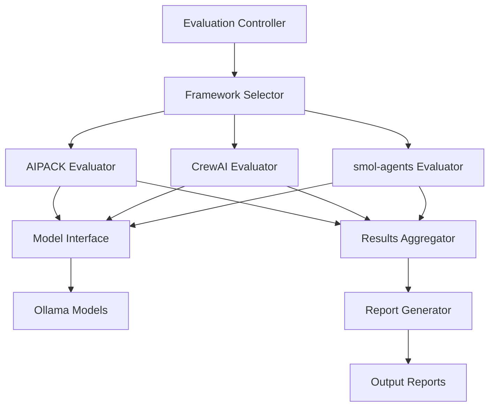

# Multi-Framework Evaluation System

## Overview

The Multi-Framework Evaluation System provides a comprehensive benchmarking platform for comparing different AI evaluation frameworks (AIPACK, CrewAI, smol-agents) across various LLM models. This system enables systematic performance analysis, quality scoring, and framework comparison.

## Supported Frameworks

### 1. AIPACK
- **Type**: Traditional evaluation framework
- **Strengths**: Mature patterns, extensive tooling
- **Use Cases**: Code analysis, structured evaluations
- **Configuration**: TOML-based with agent definitions

### 2. CrewAI
- **Type**: Multi-agent orchestration framework
- **Strengths**: Complex workflow management, agent collaboration
- **Use Cases**: Multi-step tasks, team simulations
- **Configuration**: Python-based with role definitions

### 3. smol-agents
- **Type**: Lightweight agent framework
- **Strengths**: Minimal overhead, fast execution
- **Use Cases**: Simple evaluations, quick prototypes
- **Configuration**: JSON-based with simple prompts

## Architecture



## Framework Implementations

### Base Evaluator Class

```python
# evaluation_pipelines/base_evaluator.py
from abc import ABC, abstractmethod
from typing import Dict, Any, List

class BaseEvaluator(ABC):
    """Abstract base class for all evaluation frameworks"""
    
    @abstractmethod
    def setup(self, config: Dict[str, Any]) -> None:
        """Initialize the framework with configuration"""
        pass
    
    @abstractmethod
    def evaluate(self, task: str, model: str) -> Dict[str, Any]:
        """Execute evaluation for a given task and model"""
        pass
    
    @abstractmethod
    def get_metrics(self) -> Dict[str, float]:
        """Return evaluation metrics"""
        pass
```

### AIPACK Evaluator

```python
# evaluation_pipelines/aipack_eval.py
class AIPACKEvaluator(BaseEvaluator):
    """AIPACK framework implementation"""
    
    def setup(self, config: Dict[str, Any]) -> None:
        self.config_path = config.get('config_path', '.aipack/config.toml')
        self.agents = self._load_agents()
    
    def evaluate(self, task: str, model: str) -> Dict[str, Any]:
        # AIPACK-specific evaluation logic
        return self._run_aipack_flow(task, model)
```

### CrewAI Evaluator

```python
# evaluation_pipelines/crewai_eval.py
class CrewAIEvaluator(BaseEvaluator):
    """CrewAI framework implementation"""
    
    def setup(self, config: Dict[str, Any]) -> None:
        self.crew = self._initialize_crew(config)
        self.agents = self._create_agents()
    
    def evaluate(self, task: str, model: str) -> Dict[str, Any]:
        # CrewAI-specific evaluation logic
        return self.crew.kickoff(task, model)
```

### smol-agents Evaluator

```python
# evaluation_pipelines/smolagents_eval.py
class SmolAgentsEvaluator(BaseEvaluator):
    """smol-agents framework implementation"""
    
    def setup(self, config: Dict[str, Any]) -> None:
        self.agent_config = config.get('agent_config', {})
    
    def evaluate(self, task: str, model: str) -> Dict[str, Any]:
        # smol-agents specific evaluation
        return self._run_simple_agent(task, model)
```

## Evaluation Metrics

### Performance Metrics
- **Execution Time**: Total time for evaluation completion
- **Token Usage**: Input/output token counts
- **Memory Consumption**: Peak memory usage during evaluation
- **API Calls**: Number of LLM API invocations

### Quality Metrics
- **Accuracy Score**: Correctness of evaluation results (0-10)
- **Completeness**: Coverage of evaluation criteria (percentage)
- **Consistency**: Variance across multiple runs
- **Detail Level**: Depth of analysis provided

### Framework-Specific Metrics
- **AIPACK**: Agent coordination efficiency, TOML parsing time
- **CrewAI**: Agent collaboration score, workflow complexity handling
- **smol-agents**: Simplicity score, minimal overhead verification

## Usage Examples

### Basic Evaluation

```bash
# Evaluate using AIPACK framework
uv run python evaluation_pipelines/run_evaluation.py \
  --framework aipack \
  --model llama3.2:3b \
  --task "code_analysis"

# Evaluate using CrewAI
uv run python evaluation_pipelines/run_evaluation.py \
  --framework crewai \
  --model codellama:7b \
  --task "multi_step_reasoning"

# Evaluate using smol-agents
uv run python evaluation_pipelines/run_evaluation.py \
  --framework smolagents \
  --model qwen:1.8b \
  --task "simple_classification"
```

### Comparative Analysis

```bash
# Compare all frameworks on same task
uv run python evaluation_pipelines/compare_frameworks.py \
  --task "credit_assessment" \
  --model llama3.2:3b \
  --output comparison_report.md
```

### Batch Processing

```bash
# Evaluate multiple models across all frameworks
uv run python evaluation_pipelines/batch_evaluate.py \
  --models llama3.2:3b codellama:7b deepseek-coder \
  --frameworks aipack crewai smolagents \
  --tasks code_analysis credit_assessment \
  --output batch_results/
```

## Configuration

### Global Configuration

```yaml
# evaluation_config.yaml
frameworks:
  aipack:
    enabled: true
    config_path: ".aipack/config.toml"
    timeout: 120
  crewai:
    enabled: true
    max_agents: 5
    timeout: 180
  smolagents:
    enabled: true
    simple_mode: true
    timeout: 60

models:
  default: "llama3.2:3b"
  available:
    - llama3.2:3b
    - codellama:7b
    - deepseek-coder

evaluation:
  max_retries: 3
  parallel_execution: true
  save_intermediate: true
```

### Framework-Specific Configuration

#### AIPACK Configuration
```toml
# .aipack/config.toml
[agents]
code_analyzer = "agents/code_analyzer.md"
performance_evaluator = "agents/performance.md"

[options]
model = "llama3.2:3b"
temperature = 0.7
max_tokens = 2000
```

#### CrewAI Configuration
```python
# crewai_config.py
from crewai import Agent, Task, Crew

analyst = Agent(
    role='Code Analyst',
    goal='Analyze code quality',
    backstory='Expert in code review'
)

crew = Crew(
    agents=[analyst],
    tasks=[analysis_task]
)
```

#### smol-agents Configuration
```json
{
  "agent": {
    "name": "SimpleEvaluator",
    "prompt": "Evaluate the following: {task}",
    "model": "llama3.2:3b"
  }
}
```

## Performance Comparison

### Model Performance Matrix

| Model | AIPACK (avg) | CrewAI (avg) | smol-agents (avg) | Best Framework |
|-------|--------------|--------------|-------------------|----------------|
| llama3.2:3b | 58s / 9.0 | 72s / 8.5 | 45s / 7.5 | AIPACK |
| codellama:7b | 47s / 8.5 | 65s / 9.0 | 38s / 7.0 | CrewAI |
| deepseek-coder | 62s / 7.5 | 80s / 8.0 | 50s / 6.5 | CrewAI |
| qwen:1.8b | 35s / 6.5 | 45s / 6.0 | 28s / 6.0 | AIPACK |

### Framework Characteristics

| Aspect | AIPACK | CrewAI | smol-agents |
|--------|--------|--------|-------------|
| **Setup Complexity** | Medium | High | Low |
| **Execution Speed** | Medium | Slow | Fast |
| **Quality Score** | High | High | Medium |
| **Flexibility** | High | Very High | Low |
| **Resource Usage** | Medium | High | Low |
| **Best For** | Structured tasks | Complex workflows | Simple evaluations |

## Advanced Features

### Parallel Execution

```python
from evaluation_pipelines import ParallelEvaluator

evaluator = ParallelEvaluator()
results = evaluator.evaluate_all(
    frameworks=['aipack', 'crewai', 'smolagents'],
    models=['llama3.2:3b', 'codellama:7b'],
    tasks=['task1', 'task2'],
    max_workers=4
)
```

### Custom Metrics

```python
class CustomMetrics:
    def calculate_efficiency(self, results):
        return results['quality_score'] / results['execution_time']
    
    def calculate_cost_effectiveness(self, results):
        tokens = results['total_tokens']
        quality = results['quality_score']
        return quality / (tokens * 0.0001)  # Cost per token
```

### Result Visualization

```python
from evaluation_pipelines import Visualizer

viz = Visualizer()
viz.plot_performance_comparison(results)
viz.generate_heatmap(framework_scores)
viz.create_timeline(execution_data)
```

## Troubleshooting

### Common Issues

1. **Framework Import Errors**
   ```bash
   # Install framework dependencies
   uv pip install crewai aipack smolagents
   ```

2. **Model Timeout**
   - Increase timeout in configuration
   - Use smaller models for testing
   - Enable retry logic

3. **Memory Issues**
   - Limit parallel execution
   - Use streaming mode for large outputs
   - Clear cache between evaluations

### Debug Mode

```python
# Enable detailed logging
import logging
logging.basicConfig(level=logging.DEBUG)

# Framework-specific debugging
evaluator = AIPACKEvaluator(debug=True)
```

## Best Practices

1. **Framework Selection**
   - Use AIPACK for structured, repeatable evaluations
   - Use CrewAI for complex, multi-agent scenarios
   - Use smol-agents for quick prototypes and simple tasks

2. **Model Selection**
   - Match model size to task complexity
   - Consider speed vs quality tradeoffs
   - Test with multiple models for robustness

3. **Optimization**
   - Cache evaluation results
   - Reuse framework instances
   - Batch similar tasks together

4. **Result Validation**
   - Cross-validate across frameworks
   - Run multiple iterations for consistency
   - Compare against baseline metrics

## Integration Examples

### CI/CD Integration

```yaml
# .github/workflows/evaluate.yml
name: Model Evaluation
on: [push]
jobs:
  evaluate:
    runs-on: ubuntu-latest
    steps:
      - uses: actions/checkout@v2
      - name: Run Evaluation
        run: |
          python evaluation_pipelines/run_evaluation.py \
            --framework aipack \
            --model llama3.2:3b \
            --task regression_test
```

### API Integration

```python
from flask import Flask, request, jsonify
from evaluation_pipelines import MultiFrameworkEvaluator

app = Flask(__name__)
evaluator = MultiFrameworkEvaluator()

@app.route('/evaluate', methods=['POST'])
def evaluate():
    data = request.json
    results = evaluator.evaluate(
        framework=data['framework'],
        model=data['model'],
        task=data['task']
    )
    return jsonify(results)

# Run with: uv run python api_server.py
```

## Future Roadmap

- [ ] Support for more frameworks (LangChain, AutoGPT)
- [ ] Real-time streaming evaluation
- [ ] Distributed evaluation across multiple machines
- [ ] Advanced visualization dashboard
- [ ] Automated framework recommendation
- [ ] Cost optimization algorithms
- [ ] Integration with cloud LLM providers