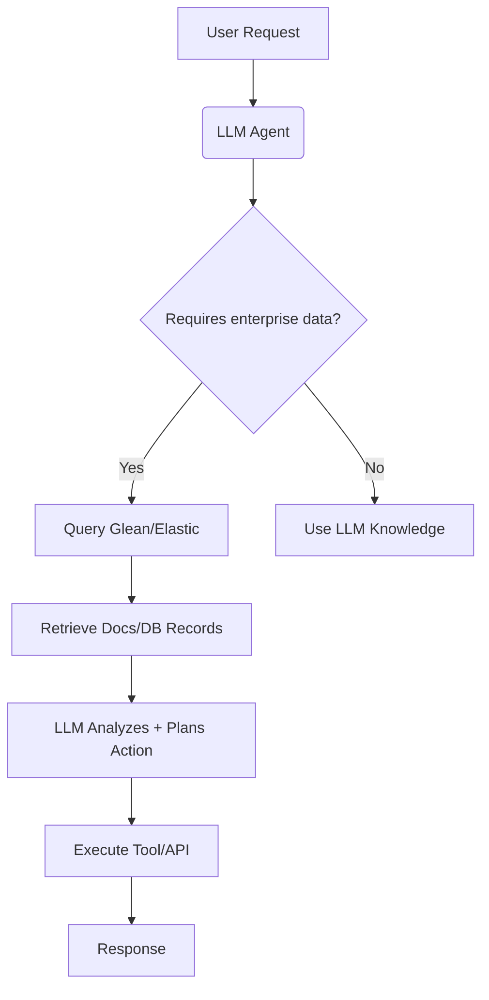

---

### 🔗 **How Federated Search (Glean/Elastic) Contributes to AI Agent Platforms**
| **Contribution**          | **Mechanism**                                                                 | **Agent Use Case**                                                                 |
|---------------------------|-------------------------------------------------------------------------------|-----------------------------------------------------------------------------------|
| **Unified Knowledge**     | Aggregates siloed data (Slack, DBs, Confluence) into single query interface   | Agent accesses *all* enterprise context for decision-making                        |
| **Real-Time Data Bridge** | Live connectors to operational systems (CRM, ERP)                             | Agents act on *current* data (e.g., "Process refund using today's sales DB")      |
| **Permission Filtering**  | Respects role-based access controls natively                                  | Agents auto-adjust actions based on user privileges (security compliance)          |
| **Query Disambiguation**  | Understands domain-specific jargon via curated taxonomies                     | Resolves ambiguous agent requests (e.g., "CR" = Clinical Record vs. Code Review)  |

> **Example Agent Workflow**:  
> `User Request → Agent Planner → Federated Search → Glean retrieves latest docs/DB entries → LLM synthesizes → Agent executes action`

---

### ⚖️ **Federated Search vs. LLMs: Key Differences**
| **Attribute**         | **Federated Search (Glean/Elastic)**                     | **LLMs**                                      |
|------------------------|----------------------------------------------------------|-----------------------------------------------|
| **Core Function**      | Information *retrieval* from structured sources          | Information *generation* + *reasoning*        |
| **Data Handling**      | Queries existing data (no modification)                  | Creates new content/decisions                 |
| **Knowledge Scope**    | Limited to indexed enterprise systems                    | Broad but static (training data cutoff)       |
| **Determinism**        | High (exact matches via BM25/vector search)              | Probabilistic (hallucinations possible)       |
| **Adaptability**       | Requires manual connector setup                          | Learns contextually from prompts             |

---

### ✅ **Advantages of Federated Search over LLMs**
1. **Precision for Enterprise Data**  
   - Retrieves *exact* internal docs (e.g., "Q4 2023 Pricing Sheet V2.1")  
   - LLMs hallucinate internal specifics without RAG grounding  

2. **Real-Time Accuracy**  
   - Accesses live CRM/ERP data (e.g., current inventory levels)  
   - LLMs rely on stale training data  

3. **Compliance & Security**  
   - Inherits permission models from source systems  
   - LLMs risk leaking sensitive data via prompt injection  

4. **Cost Efficiency**  
   - $0.0001/query vs. $0.01-0.10/LLM call  
   - Critical for high-volume agent operations  

---

### ⚠️ **Trade-offs of Federated Search in Agent Systems**
| **Advantage**               | **Trade-off**                                                                 |
|-----------------------------|-------------------------------------------------------------------------------|
| **High precision**          | Limited to pre-indexed data (misses novel patterns)                           |
| **Permission safety**       | Cannot synthesize *across* restricted domains (e.g., Sales × Engineering data) |
| **Real-time data access**   | No contextual understanding (e.g., "urgent" vs. "standard" ticket)            |
| **Deterministic results**   | Brittle to natural language variations (requires perfect keyword matching)    |

---

### 🔄 **Optimal Synergy: Federated Search + LLM Agents**


**Real-World Example**:  
*Healthcare Prior Authorization Agent*  
1. LLM interprets patient request: "Need approval for MRI"  
2. Federated search retrieves:  
   - Insurance policy PDF (SharePoint)  
   - Patient eligibility (Epic EHR)  
   - Clinic capacity (Scheduling DB)  
3. LLM generates:  
   ```json
   {"action": "submit_authorization", 
    "codes": ["CPT-70553"], 
    "deadline": "2024-06-30"}
   ```

---

### 💎 **Conclusion**
- **Federated search is the agent's "sensory layer"**:  
  Provides **accurate, real-time enterprise data retrieval** but *no reasoning*.  
- **LLMs are the "cognitive layer"**:  
  Enables **decision-making/action planning** but *requires grounding*.  

**Trade-off Mitigation Strategy**:  
```python
if user_query.requires("precise_data"): 
   use_federated_search()  # Glean/Elastic
elif user_query.requires("reasoning"):
   use_llm()               # + RAG from search results
else: 
   use_hybrid()            # 80% of agent use cases
```

For enterprise agents, federated search isn’t a *replacement* for LLMs—it’s the **critical infrastructure that makes LLM agents operationally viable**. The future lies in deeply integrated stacks (e.g., Glean + Azure Copilot).
