Here’s a **minimalist, user-controlled, privacy-first ontology** for AI agents, designed to strip away complexity while prioritizing absolute data sovereignty and transparency:  

---

### 🧱 **Core Principles**  
1. **Radical Minimalism**: Only 3 entity types, 2 relationships, 1 action primitive.  
2. **User as Sovereign**: User owns/controls all data and permissions.  
3. **Privacy by Default**: No data leaves local device unless explicitly permitted.  
4. **Zero Trust**: No implicit assumptions; every access requires explicit consent.  

---

### 🗃️ **Ontology Structure**  
#### **Entities**  
| **Entity**       | **Definition**                                  | **Privacy Enforcement**                     |  
|------------------|------------------------------------------------|--------------------------------------------|  
| `User`           | Human operator (sole authority)                | Owns all data; all actions require `User:approve` |  
| `DataPod`        | Encrypted container for user data              | Local-only storage; auto-deletes after use |  
| `Action`         | Single atomic task (e.g., `summarize`, `translate`) | Runs on-device; no internet access          |  

#### **Relationships**  
```python  
# Only two allowed:  
User --controls--> DataPod  # User decides when/how data is used  
User --triggers--> Action   # Actions only run via direct user command  
```  

#### **Actions**  
- **Format**: `Action(input: DataPod, output: DataPod)`  
- **Rules**:  
  - No data persistence: Output auto-deletes after user access.  
  - No chaining: Actions can’t call other actions (prevents autonomy).  
  - No external tools: All computation is local.  

---

### 🛡️ **Privacy Enforcement Mechanics**  
| **Mechanism**          | **Implementation**                              |  
|------------------------|------------------------------------------------|  
| **Data Vaulting**      | `DataPods` use TEEs (Trusted Execution Environments) |  
| **Consent Logs**       | Blockchain-style ledger of user permissions (readable by user) |  
| **Data Lifespan**      | `DataPod` self-destructs 60s after action completion |  
| **Network Rules**      | Physical "air-gap" switch for internet disconnection |  

---

### ⚙️ **Workflow Example: Secure Health Summary**  

```mermaid  
flowchart LR  
    A[User] --> B[Trigger: “Summarize my health data”]  
    B --> C[Action: summarize]  
    C --> D[Input: DataPod#23]  
    D --> E[Process: On-device LLM]  
    E --> F[Output: New DataPod#24]  
    F --> G[User views summary]  
    G --> H[DataPod#23 & #24 erased]  
```  

- **Key**: No cloud, no intermediaries, no data persistence.  

---

### 🔄 **Comparison vs. Mainstream Ontologies**  
| **Feature**         | **Minimalist Privacy Ontology**       | **Anthropic/OpenAI/Microsoft**        |  
|---------------------|--------------------------------------|---------------------------------------|  
| **Data Storage**    | Ephemeral `DataPods` (on-device)     | Centralized servers/cloud             |  
| **User Control**    | All actions require explicit trigger | Autonomous agent chains               |  
| **Network Access**  | Physically disabled by default       | Always-on API calls                   |  
| **Auditability**    | User-readable consent ledger         | Proprietary black-box logs            |  

---

### ⚠️ **Tradeoffs**  
- **✅ Pros**:  
  - Provable privacy (mathematically verifiable).  
  - No surveillance risks.  
- **❌ Cons**:  
  - Limited functionality (no multi-step reasoning).  
  - No collaboration between agents.  
  - Hardware-dependent (requires TEE-capable device).  

---

### 🧪 **Implementation Tools**  
- **Hardware**: Raspberry Pi 5 + TPM 2.0 chip.  
- **Software**:  
  ```python  
  class DataPod:  
      def __init__(self, raw_data):  
          self.data = aes_256_encrypt(raw_data)  
          self.death_timer = threading.Timer(60.0, self.erase)  # 60s lifespan  
      def erase(self):  
          write_zeros(self.data)  # Crypto-shredding  
  ```  

---

### 💎 **Conclusion**  
This ontology reduces AI agents to **privacy-computing appliances**:  
1. User agency is absolute.  
2. Data exists fleetingly.  
3. Functionality is sacrificed for verifiable security.  
**Ideal for**: Healthcare, whistleblowing, or anyone valuing privacy over convenience. For broader functionality, hybrid models (e.g., allowing *optional* encrypted cloud processing) can be layered atop—but the core remains minimalist.
